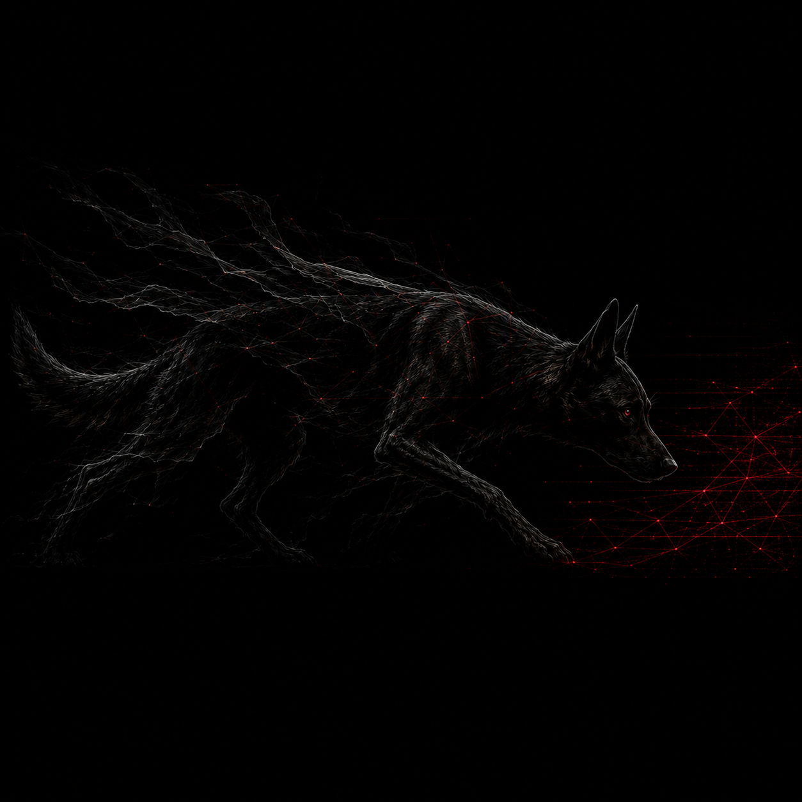

<p align="center"></p>

<h1 align="center">NoiseHound</h1>

<p align="center">
  <a href="https://pypi.org/project/noisehound/"></a>
  <a href="https://github.com/warpedatom/NoiseHound/releases"></a>
  <a href="./LICENSE"></a>
  
  <a href="https://github.com/warpedatom/NoiseHound/actions/workflows/ci.yml"></a>
  <a href="./SECURITY.md"></a>
  <a href="https://x.com/warped_atom"></a>
</p>

**Detection-aware Active Directory attack-path scoring.**
_DreadHost Research | companion to OffsetInspect (PowerShell) and OffsetScan (Rust)_

BloodHound (and PlumHound on top of it) finds *a* path to the objective.
NoiseHound ingests the same graph data and re-ranks paths by **expected
detection cost** instead of hop count, so an operator can ask "what is the
quietest way to Domain Admin" instead of just "what is a way".

> **Project status (v1.0):** stable and tested on real BloodHound data across
> multiple domains. **30 of the 57 on-prem edges are lab-measured** across four
> detection tiers (audit, Defender for Endpoint, Elastic SIEM, and MDI posture) -
> shipped as drop-in profiles in [`profiles/`](profiles/), with closed-loop proof
> they change path rankings ([`docs/VALIDATION.md`](docs/VALIDATION.md)). The corpus
> also now includes 13 **Azure/Entra** edges ([`docs/AZURE.md`](docs/AZURE.md)).
> Un-measured on-prem and all Azure edges carry **expert estimates**; the calibration
> harness (`noisehound-calibrate`) is how they, and your own environment, get
> measured. Treat uncalibrated rankings as well-reasoned guidance, not ground truth.

> For authorized engagements only. This tool scores attack paths for OPSEC
> planning against systems you have written permission to test.

> NoiseHound is an independent community project. It is not affiliated with,
> endorsed by, or associated with SpecterOps or the BloodHound project; it
> consumes BloodHound's open data format.

---

## How it works

1. **Ingest** a BloodHound CE export (`.zip`), a raw JSON file, or a directory
   of exports into an internal graph. A normalised `{nodes, edges}` JSON format
   is also accepted for offline analysis and tests. AD CS **ESC1-8** escalation
   edges are synthesised at load time from the certificate-template and CA facts
   BloodHound collects (see below).
2. **Annotate** every edge from the edge-telemetry corpus, attaching an
   `effective_noise_score` (0-100). Where several rights connect the same pair
   of nodes, the quietest is chosen. Edge types absent from the corpus default
   to a conservative score (60) so gaps fail safe rather than under-reporting.
   An optional **environment profile** adjusts scores for the target's declared
   detection posture (see below).
3. **Solve** for the quietest paths. Because the path score is a bottleneck plus
   mean (not a simple sum), it cannot be optimised directly by Dijkstra. The
   solver combines a *threshold sweep* (for each distinct noise level, the
   quietest route that stays under it) with a bounded k-shortest-by-weight pass,
   then re-ranks the union by the real path score. The threshold sweep is the
   correctness backstop: it surfaces a long-but-uniformly-quiet path that a pure
   summed-weight search would rank below a short-but-loud one.
4. **Report** as text, JSON (interoperable with the OffsetInspect result
   schema), or a self-contained HTML report styled to match the toolset.

### Path scoring

Path noise is deliberately **not** a simple sum. Tripping the same detection
twice is not twice as loud (SOC triage, not raw event count). NoiseHound uses:

```
path_score = max(edge_scores) * 0.6 + mean(edge_scores) * 0.4
```

This weights toward the loudest single step (one bad step often burns the whole
op) while still accounting for cumulative exposure. The weights are configurable
(`--max-weight` / `--mean-weight`) so they can be tuned empirically once real
detection data is available from an APT29/Caldera lab.

Every path also reports a **detection probability** - the chance it trips a
correlated alert - blending the loudest edge with the cumulative noisy-OR of all
edges (tuned by `--correlation`). It answers a different question than the noise
score: a short but loud path can have a *lower* overall probability of being
caught than a long but quiet one. Rank by it with `--rank-by probability`.

### Two-tier engine (DeadAir)

For large graphs the solve is dispatched to [DeadAir](../deadair), a companion
Rust engine (the OffsetScan-to-OffsetInspect tier). NoiseHound stays the
feature-rich frontend - ingestion, corpus, environment/Sigma, constraints,
reporting - and hands the prepared graph to whichever engine solves it, so
results are identical either way.

- `--engine auto` (default): DeadAir when its binary is found *and* the graph is
  large (>= 5000 nodes); the built-in Python solver otherwise.
- `--engine python`: force the built-in solver (no binary needed).
- `--engine rust`: force DeadAir (errors if the binary is missing).

DeadAir is found via `$NOISEHOUND_DEADAIR`, then `PATH`, then the sibling
`../deadair/target/{release,debug}/` build. It is 10-100x faster on large graphs
(a 250k-node graph solves in ~2s vs ~30s in Python) while producing byte-identical
rankings. The output records which engine ran.

### Multi-objective and constrained pathing

Noise, hop count, and detection probability pull in different directions, so
`--pareto` returns the **Pareto frontier** - every path that no other beats on
all three at once - instead of forcing a single winner. And real operations
have constraints: `--avoid NODE` keeps a path off a specific host (an
EDR-monitored jump box, a honeypot), and `--avoid-edge TYPE` refuses a technique
(e.g. `--avoid-edge DCSync`). Both are repeatable and re-solve on the fly.

```bash
python -m noisehound -i export.zip -s jdoe -o "Domain Admins" --pareto
python -m noisehound -i export.zip -s jdoe -o "Domain Admins" --avoid FILESERVER01 --avoid-edge HasSession
```

---

## How NoiseHound compares

Weighted BloodHound pathfinding is not new, so here is the honest positioning:

- **BloodHound / BloodHound CE** find *a* path by unweighted hop count. No noise
  model.
- **GoodHound** assigns edge costs and finds cheapest paths, but its cost model
  is exploitation difficulty and business risk, not detection noise.
- **PlumHound / ImproHound** do reporting and tier-violation analysis; neither
  re-solves for a quietest-to-objective path.
- **Detection mappings** (Sigma, DeTT&CT, event-ID-to-ATT&CK references) are
  rich but human-oriented and not keyed to BloodHound edge kinds.

NoiseHound's contribution is the combination: a machine-readable
BloodHound-edge-to-detection-telemetry corpus, a noise-weighted re-solve framed
as operator OPSEC ("quietest way to DA"), an environment model that adapts to a
target's declared posture, and a calibration loop that turns lab detections into
measured scores. The graph math is commodity; the corpus and the framing are the
point. Its value is only as good as the corpus, which is why calibration and
community contribution are first-class - see below.

## Install

```bash
cd NoiseHound
python -m pip install -r requirements.txt   # networkx>=3.0
# optional editable install to get the `noisehound` command on PATH:
python -m pip install -e .
```

Requires Python 3.10+.

## Usage

```bash
# Text summary (default)
python -m noisehound --input export.zip --objective "Domain Admins" --source jdoe

# JSON, for downstream tooling / correlation across the DreadHost suite
python -m noisehound -i export.zip -o "Domain Admins" -s jdoe -f json --out paths.json

# Self-contained HTML report
python -m noisehound -i export.zip -o "Domain Admins" -s jdoe -f html --out report.html
```

First, sanity-check the parser on your export (histograms + corpus coverage,
no pathing) - the fastest way to validate NoiseHound on real-world data:

```bash
noisehound-inspect -i export.zip
```

### Live BloodHound CE / Neo4j

Instead of a zip, point `--input` at the Neo4j database BloodHound CE populates
and NoiseHound reads the (already analysed) graph directly over Bolt:

```bash
pip install 'noisehound[neo4j]'
export NEO4J_PASSWORD=bloodhoundcommunityedition   # match your BHCE compose
noisehound-inspect -i bolt://localhost:7687
python -m noisehound -i bolt://localhost:7687 -s jdoe -o "Domain Admins"
```

Stand up BloodHound CE (bundles Neo4j on 7687) with its official compose:
`curl -L https://ghst.ly/getbhce | docker compose -f - up`.

Try it against the bundled samples:

```bash
python -m noisehound -i samples/sample_graph.json -s jdoe -o "Domain Admins" -d CONTOSO.LOCAL
python -m noisehound -i samples/sample_bloodhound_ce.zip -s jdoe -o "Domain Admins"
python -m noisehound -i samples/sample_adcs_ce.zip -s jdoe -o "Domain Admins"   # ADCS ESC1
# Full-spectrum export exercising every edge family (sessions, delegation, DCSync, ADCS, trusts):
python -m noisehound -i samples/sample_fullspectrum_ce.zip -s ALICE -o "Domain Admins" -d CONTOSO.LOCAL -k 3
```

That last one is the clearest demo of the thesis: the quietest route to Domain
Admins is the 4-hop session path, ranked *above* the 3-hop RDP path and the
1-hop ADCS ESC1 - most hops, least noise.

The sample demonstrates the core value: the quietest route is a 4-hop session
path (score 19.9), ranked *above* a 2-hop ForceChangePassword shortcut (36.4).
Fewer hops does not mean quieter.

### Blue-team detection-gap mode

The quietest path is where detection is weakest, so add `--defensive` to flip
the output for defenders: it flags the edges that are quiet only because their
telemetry is off or absent, maps each to the control that would catch it, and
ranks those controls by how much they raise the quietest-path score.

```bash
python -m noisehound -i export.zip -s jdoe -o "Domain Admins" --defensive
```

On the full-spectrum sample it finds that the quietest path to Domain Admins
hinges on undetected LSASS access (`HasSession`, 20 -> 65 if instrumented) and
recommends deploying Sysmon Event 10 - closing that one gap lifts the quietest
path from 19.9 to 48.4. See [`docs/ROADMAP.md`](docs/ROADMAP.md) for where this
and the rest of the model are headed.

### Key options

| Option | Meaning |
|--------|---------|
| `--input, -i` | BloodHound `.zip`, `.json`, or directory of exports |
| `--source, -s` | Starting principal (`jdoe` or an object id) |
| `--objective, -o` | Target node (`Domain Admins` or an object id) |
| `--paths, -k` | Number of quietest paths to return (default 5) |
| `--format, -f` | `text` (default), `json`, or `html` |
| `--defensive` | Blue-team view: detection gaps on the quietest paths + fixes |
| `--rank-by` | `noise` (default) or `probability` (P of a correlated alert) |
| `--correlation` | SOC correlation coefficient for P(detected), 0..1 (default 0.5) |
| `--pareto` | Return the Pareto frontier over noise/hops/P(detect) |
| `--engine` | `auto` (default), `python`, or `rust` (the DeadAir engine) |
| `--avoid NODE` | Exclude a node from all paths (repeatable) |
| `--avoid-edge TYPE` | Exclude an edge type from all paths (repeatable) |
| `--corpus` | Override the edge-mapping corpus directory |
| `--environment, -e` | Operator-declared target posture JSON (adjusts scores) |
| `--max-weight` / `--mean-weight` | Scoring weights (must sum to 1.0) |
| `--default-noise` | Score for edge types absent from the corpus (default 60) |

---

## Environment profiles

A static corpus score cannot know whether a given target has 4662 object
auditing on, ships Sysmon, or runs an ITDR like MDI - yet those move an edge's
real noise enormously (DCSync is near-silent without 4662 auditing and
near-certain-detection with it). Instead of pretending one number fits every
environment, declare the target's posture in a small JSON file and NoiseHound
adjusts scores transparently against the corpus's own telemetry annotations:

```json
{
  "name": "CONTOSO.LOCAL-prod",
  "object_auditing_4662": true,
  "ds_change_auditing_5136": false,
  "edr": "MDI",
  "sysmon": true,
  "powershell_logging_4104": true,
  "adjustments": { "HasSession": 65 }
}
```

Adjustments only ever *raise* a score toward a detection floor implied by the
declared posture. `adjustments` are hard per-edge overrides - the place to
record values you have calibrated against your own lab. This is operator-supplied,
not measured; it does not replace Phase 2 live validation, but it turns the
static corpus from "one number for all environments" into "the number for the
environment you are actually in". On the bundled sample, declaring the profile
above flips the quietest route from the LSASS-dump session path to a
directory-write path - which is the correct call once host telemetry is live.

```bash
python -m noisehound -i samples/sample_graph.json -s jdoe -o "Domain Admins" \
    -e samples/env_profile.example.json
```

Score precedence: `static -> environment-adjusted -> live (Phase 2)`.

---

## Calibration harness

Environment profiles are only as good as the numbers you put in them.
`noisehound-calibrate` closes the loop: run the techniques in a detection lab,
record what fired, and it emits a calibrated environment profile.

**This has been done.** [`profiles/`](profiles/) ships three measured profiles from
a real Hyper-V Vulnerable-AD range - audit, EDR (Defender for Endpoint), and Elastic
SIEM tiers, 30 edges - produced by the automated harness (`lab/`) and this tool. Use
them directly, or measure your own:

```bash
# Use a shipped measured profile:
noisehound -i export.zip -s jdoe -o "Domain Admins" -e profiles/vulnad-hyperv-audit.json

# Or measure your own lab:
# 1. noisehound-calibrate --plan -o plan.json   (per-edge detection events)
# 2. lab/Invoke-NoiseHoundCalibration.ps1        (run + auto-count -> lab_detections.json)
noisehound-calibrate -i lab_detections.json -o env.calibrated.json
noisehound -i export.zip -s jdoe -o "Domain Admins" -e env.calibrated.json
```

The score model is a shrinkage estimator, honest about sample size:

```
p          = detections / runs                       (detection probability)
lab_score  = p * severity_loudness + (1 - p) * residual
w          = runs / (runs + smoothing)               (confidence in the lab)
calibrated = w * lab_score + (1 - w) * corpus_static
```

`lab_score` is the expected detection cost - the SOC severity when it fires,
a small residual when it does not. The weight `w` keeps a single run from
overriding the corpus while letting a well-sampled result dominate. On the
example, HasSession climbs from a static 20 to 52 (the lab caught the LSASS
dump 4 of 5 runs) while Kerberoast drops from 60 to 34 (it never fired). Use
`--merge existing.json` to overlay new calibration onto a profile while keeping
its posture flags, and `--smoothing` / `--residual` to tune the model.

---

## Score against deployed detections (Sigma)

Environment profiles and calibration are self-declared. `noisehound-sigma`
scores against the detections a defender has *actually written*: point it at a
Sigma rule set and it works out which corpus edges each rule would fire on
(matching the edge's telemetry event IDs and ATT&CK technique), then emits an
environment profile that raises the covered edges - a drop-in for `--environment`.

```bash
noisehound-sigma -r ./sigma-rules/ -o env.sigma.json
python -m noisehound -i export.zip -s jdoe -o "Domain Admins" -e env.sigma.json --defensive
```

Matching is deliberately conservative so it never hides a gap: a rule only
counts if it references an event ID the edge generates *and*, when the rule is
ATT&CK-tagged, its technique agrees - so a DS-Access (4662) DCSync rule is not
miscredited with covering LAPS reads that merely share the event ID. The report
lists both what your rules cover and, more usefully, the attack edges no rule
covers. Combined with `--defensive`, this answers "given the detections I have
deployed, where is my quietest attack path still invisible?"

---

## AD CS ESC1-8

At load time NoiseHound performs a focused version of BloodHound's ADCS
post-processing, synthesising escalation edges from the retained template/CA
facts. An `Enroll` right on a vulnerable template becomes a direct
`ADCSESCn` edge from the principal to the domain's Domain Admins group (RID 512),
so certificate escalation is pathable and scored like any other edge:

| Edge | Condition |
|------|-----------|
| `ADCSESC1` | Enrollee-supplies-subject + client-auth EKU, no approval/RA sigs |
| `ADCSESC2` | Any-Purpose / SubCA EKU, no approval |
| `ADCSESC3` | Enrollment-agent template + an auth template on the same CA |
| `ADCSESC4` | Dangerous write control over a published template |
| `ADCSESC5` | Control of the CA object or its hosting computer |
| `ADCSESC6` | CA has `EDITF_ATTRIBUTESUBJECTALTNAME2` set |
| `ADCSESC7` | `ManageCA` / `ManageCertificates` on the CA |
| `ADCSESC8` | Vulnerable HTTP web-enrollment endpoint (coerce + NTLM relay) |

Try it: `python -m noisehound -i samples/sample_adcs_ce.zip -s jdoe -o "Domain Admins"`.

Documented simplifications (they fail safe toward showing more paths): CA-level
enrollment restrictions are not modelled (template enrollment is treated as
sufficient); ESC5 covers the CA object and its host, not every PKI container;
ESC9/10/13 are out of scope. Synthetic ESC edges already present in a
post-processed export are preserved.

---

## The corpus (`edge_mappings/`)

The edge-telemetry corpus is the actual IP of this tool; the code is
comparatively simple graph math on top of it. Each `edge_mappings/<Edge>.json`
maps a BloodHound edge type to its detection surface:

- expected telemetry sources (Windows Security Event IDs, Sysmon Event IDs,
  network, EDR/ITDR heuristics) with per-source reliability and whether the
  relevant auditing is on by default
- a static noise score (0-100)
- MITRE technique, prerequisite privilege, the usual abuse primitive, and notes

```json
{
  "edge_type": "DCSync",
  "static_noise_score": 85,
  "telemetry": [
    {"source": "windows_security", "event_id": 4662,
     "detail": "Directory Service Access - requires object auditing (default OFF)",
     "reliability": "high_if_auditing_enabled", "default_enabled": false},
    {"source": "edr_heuristic", "product_class": "MDI",
     "detail": "Non-DC hosts issuing DRSGetNCChanges - high fidelity",
     "reliability": "high"}
  ],
  "mitre_technique": "T1003.006",
  "notes": "Assumes default audit policy (mostly OFF) but high EDR/MDI coverage."
}
```

Extending the corpus is where most ongoing effort should go. Add a new JSON
file, keep the schema (validated at load time), and it is picked up
automatically. v0.3 ships 43 edge types covering the ACL-abuse, Kerberos,
delegation, ADCS ESC1-8, LAPS/gMSA, GPO, trust, and access-right edges that
matter for path-finding.

Scores are seeded from the DreadHost Red Team Operator Playbook noise matrix
(Windows/Sysmon event mappings, technique noise ratings) and standard AD
detection facts. Tune them against your own lab detection data.

---

## Roadmap

- **Azure / Entra ID coverage (foundation shipped, expanding).** 13 `AZ*`
  attack-path edges now ship with Entra-native detection telemetry - see
  [`docs/AZURE.md`](docs/AZURE.md). Azure data collected via AzureHound into
  BloodHound CE is scored today (`noisehound -o "Global Administrator"`). Next:
  AzureHound-native ingestion, Entra posture profiles (MDCA / ID Protection /
  Sentinel), hybrid edges (Entra Connect / PHS-PTA) so **MDI** contributes across
  the on-prem/cloud boundary, and a measured Azure calibration tier.
- **Finish calibration - 30/57 measured, continuing.** Remaining ~27 edges
  (coercion/relay, ADCS ESC2-13), the **MDI runtime-alert tier** (posture works;
  the alert path needs a bare-metal/Ludus DC - see `docs/CALIBRATION.md`), and a
  multi-EDR corpus (CrowdStrike/S1 beside MDE), plus per-edge tooling calibration to
  broaden the `--tooling` axis.
- **MDI as a first-class detection source.** Map MDI's posture (ISPM) assessments
  and named identity alerts to corpus edges - a coverage view like `noisehound-sigma`
  but for Defender for Identity.
- **ADCS ESC10a/10b/13 synthesis** (ESC1-9 synthesis ships now).

Shipped: the Rust engine ([DeadAir](../deadair), `--engine` dispatch), live Neo4j
Bolt ingestion (`--input bolt://...`), the selectable **`--tooling`** axis
(off-the-shelf-on-host vs remote/native; `docs/TOOLING_AXIS.md`), and the Phase 2
**`--live-scores`** hook (measured scores override the corpus/environment).

## Contributing

The corpus is community-extensible and that is where contributions matter most.
Adding an edge is one JSON file validated on load and in CI:

```bash
noisehound-validate              # schema + consistency checks over the corpus
python -m pytest tests/ -q
```

See [CONTRIBUTING.md](CONTRIBUTING.md) for the schema, the scoring guide, and PR
guidance, and [`docs/edge_schema.json`](docs/edge_schema.json) for the formal
edge schema.

## Calibrating against a lab

30 edges are measured (see [`profiles/`](profiles/)); the rest are estimates until
you measure them, and every environment differs. [`docs/CALIBRATION.md`](docs/CALIBRATION.md)
is a full playbook: lab topology, the exact Windows audit policy and Sysmon
config to make the corpus's event IDs fire, a per-edge exercise runbook, an
APT29-via-Caldera realism layer, and how to compile results into a calibrated
profile. Start with `noisehound-calibrate --template -o lab_detections.json`.

The [`lab/`](lab/) kit automates the detection instrumentation:
`Enable-Telemetry.ps1` turns on the audit policy, script-block logging, DCSync
SACL, and Sysmon; `Collect-Detections.ps1` tallies what fired in a window. It
leans on [GOAD](https://github.com/Orange-Cyberdefense/GOAD) or
[Vulnerable-AD](https://github.com/WazeHell/vulnerable-AD) (or your CRTP/CRTO
lab) for the vulnerable domain itself rather than reimplementing them.

## Responsible use

NoiseHound is for authorized security testing, purple-team exercises, detection
engineering, and research. It reads BloodHound data you already collected and
computes rankings; it executes nothing against a target. Use it only where you
have explicit written authorization. Contributions must not include
target-specific or real-engagement data.

## Testing

```bash
python -m pytest tests/          # with pytest
python tests/test_noisehound.py  # dependency-light smoke run
```

## Layout

```
noisehound/        engine: schema, corpus, ingest, adcs, annotate, environment,
                   solver, report, cli, calibrate
edge_mappings/     the telemetry corpus (one JSON per edge type) - the IP
samples/           sample_graph.json, sample_bloodhound_ce.zip, sample_adcs_ce.zip,
                   sample_fullspectrum_ce.zip, env_profile.example.json,
                   lab_detections.example.json, sample_report.html
tests/             unit + end-to-end tests
```
