# Operator Walkthrough — NoiseHound + DeadAir, end to end

This is a hands-on tutorial. By the end you will have installed both tools from
scratch, run a detection-aware attack-path analysis, written the noise scores
back onto a live BloodHound Community Edition graph, read them in the BloodHound
UI, and produced a blue-team detection-gap report. Every screenshot below was
produced by following these exact steps.

**The idea in one line:** BloodHound finds *a* path to Domain Admins; NoiseHound
re-ranks the paths by how *loud* they are, so you can take the quietest route
instead of the shortest.

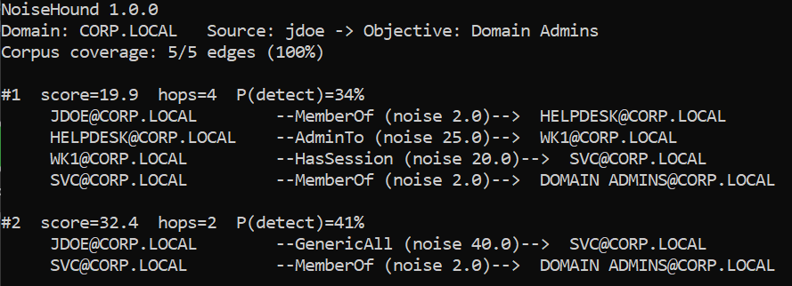

> Above: the 4-hop session path (`score 19.9`) is ranked **above** the 2-hop
> `GenericAll` shortcut (`score 32.4`). More hops, less noise — that is the whole
> point.

---

## Contents

1. [Setup — install everything](#1-setup--install-everything)
2. [Part 1 — 60-second smoke test (no infrastructure)](#2-part-1--60-second-smoke-test-no-infrastructure)
3. [Part 2 — Full BloodHound CE proof of concept](#3-part-2--full-bloodhound-ce-proof-of-concept)
4. [Part 3 — DeadAir, the native Rust engine](#4-part-3--deadair-the-native-rust-engine)
5. [Part 4 — Blue-team detection-gap mode](#5-part-4--blue-team-detection-gap-mode)
6. [The corpus at a glance](#6-the-corpus-at-a-glance)
7. [Capability highlights](#7-capability-highlights)
8. [Honest scoping](#8-honest-scoping)
9. [Troubleshooting](#9-troubleshooting)

---

## 1. Setup — install everything

You need Python for NoiseHound. DeadAir (the native engine) and Docker (for the
BloodHound CE part) are optional — Parts 1, 3 and 4 run with no infrastructure at
all.

### 1.1 Python + NoiseHound

NoiseHound needs **Python 3.10+**. Check, then install with the `neo4j` extra so
it can talk to a live BloodHound graph later:

```bash
python --version                    # need 3.10 or newer
pip install 'noisehound[neo4j]'
python -m noisehound --version      # -> NoiseHound 1.0.0
```

That single install also gives you the helper commands `noisehound-inspect`,
`noisehound-writeback`, `noisehound-calibrate`, and `noisehound-sigma`.

> Prefer isolation? `pipx install 'noisehound[neo4j]'` or a virtualenv both work.

### 1.2 DeadAir (optional, the native Rust engine)

DeadAir ships as a single binary. Install it from crates.io (needs a Rust
toolchain from <https://rustup.rs>), or grab a prebuilt binary from the
[DeadAir releases](https://github.com/warpedatom/DeadAir/releases):

```bash
cargo install deadair
deadair --version                   # -> deadair 0.2.0
```

NoiseHound finds DeadAir automatically (via `$NOISEHOUND_DEADAIR`, then `PATH`),
so once it is installed you can add `--engine rust` to any `noisehound` run.

### 1.3 Docker + BloodHound CE (only for Part 2)

Part 2 writes scores into a live BloodHound graph, so you need BloodHound
Community Edition, which bundles Neo4j. Install Docker
(<https://docs.docker.com/get-docker/>), confirm it runs, then bring up the
official BHCE stack:

```bash
docker --version                    # confirm Docker is installed and running
curl -L https://ghst.ly/getbhce | docker compose -f - up -d
```

This publishes the BloodHound UI on `http://localhost:8080` and Neo4j/Bolt on
`localhost:7687`. First launch prints a one-time random admin password in the
compose logs — set your own on first login. You now have **two** credential sets,
and it matters which is which:

| Credential | Who uses it | Where it comes from |
|------------|-------------|---------------------|
| **BHCE web login** (`admin` / your password) | the browser UI | set on first login |
| **Neo4j / Bolt** (`neo4j` / a secret) | NoiseHound over Bolt | `NEO4J_SECRET` in the BHCE compose `.env`; community default `bloodhoundcommunityedition` |

Verify the stack is healthy:

```bash
docker ps                           # graph-db, app-db and bloodhound should be "Up (healthy)"
curl -s -o /dev/null -w "%{http_code}\n" http://localhost:8080/ui/login   # -> 200
```

---

## 2. Part 1 — 60-second smoke test (no infrastructure)

The fastest way to see NoiseHound work is to point it at a bundled sample export.
No Neo4j, no Docker.

```bash
python -m noisehound -i samples/sample_bloodhound_ce.zip -s jdoe -o "Domain Admins" -k 3
```

You get a ranked list of routes to the objective, quietest first:

```
#1  score=19.9  hops=4  P(detect)=34%
     JDOE@CORP.LOCAL        --MemberOf (noise 2.0)-->     HELPDESK@CORP.LOCAL
     HELPDESK@CORP.LOCAL    --AdminTo (noise 25.0)-->     WK1@CORP.LOCAL
     WK1@CORP.LOCAL         --HasSession (noise 20.0)-->  SVC@CORP.LOCAL
     SVC@CORP.LOCAL         --MemberOf (noise 2.0)-->     DOMAIN ADMINS@CORP.LOCAL

#2  score=32.4  hops=2  P(detect)=41%
     JDOE@CORP.LOCAL        --GenericAll (noise 40.0)-->  SVC@CORP.LOCAL
     SVC@CORP.LOCAL         --MemberOf (noise 2.0)-->     DOMAIN ADMINS@CORP.LOCAL
```

`score` is the path's detection cost (lower = quieter), and `P(detect)` is the
modelled probability a SOC catches *something* along it. The quietest path is the
**longer** one: NoiseHound ranks by the loudest step, not by hop count.

Other bundled scenarios:

```bash
python -m noisehound -i samples/sample_adcs_ce.zip         -s jdoe  -o "Domain Admins"                       # ADCS ESC1
python -m noisehound -i samples/sample_fullspectrum_ce.zip -s ALICE -o "Domain Admins" -d CONTOSO.LOCAL -k 3  # many edge families
python -m noisehound -i samples/sample_bloodhound_ce.zip   -s jdoe  -o "Domain Admins" -f json --out paths.json
```

---

## 3. Part 2 — Full BloodHound CE proof of concept

Now we run against a **live** BloodHound CE graph and write the scores back so
they are visible and queryable inside the BloodHound UI.

### 3.1 Get a graph into BloodHound

**On a real engagement**, drag your SharpHound / BloodHound collection zip onto
**Explore → Upload** (or the file-ingest API) and let BHCE analyse it. Everything
below then works unchanged.

**To reproduce this walkthrough exactly, offline**, seed the small CORP.LOCAL
demo graph. This is a **safe, additive** script — it only creates the six demo
objects and never deletes anything:

```bash
# <graph-db> is the BHCE Neo4j container, e.g. bloodhound-graph-db-1
docker exec -i <graph-db> cypher-shell -u neo4j -p <neo4j-password> < docs/seed_demo_graph.cypher
```

> **Why a seed and not a sample upload?** A hand-authored micro-sample does not
> round-trip *computer/session* edges (`AdminTo`, `HasSession`) through BHCE's
> ingestion — a real SharpHound collection carries them natively, but a tiny
> teaching fixture does not. The seed reproduces the full two-route graph so the
> screenshots match. On real data you never need it.

### 3.2 Rank the paths (NoiseHound reads the live graph over Bolt)

```bash
export NEO4J_USER=neo4j
export NEO4J_PASSWORD=<neo4j-password>
noisehound-inspect -i bolt://localhost:7687                                   # sanity: node/edge counts, corpus coverage
python -m noisehound -i bolt://localhost:7687 -s jdoe -o "Domain Admins" -d CORP.LOCAL -k 3
```

Same ranked output as Part 1 — now sourced from the live database.

### 3.3 Write the scores back onto the graph

```bash
noisehound-writeback -i bolt://localhost:7687 --neo4j-user neo4j --neo4j-password <neo4j-password>
# -> wrote r.noise to 5 relationships (5 edges scored)
```

`noisehound-inspect` and `noisehound-writeback` together — coverage check, then
the scores written to the graph:

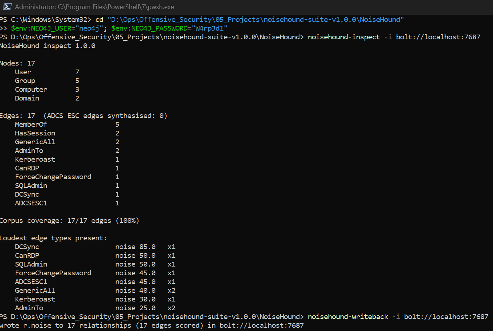

Every BloodHound relationship now carries two new properties: `noise` (0–100) and
`noise_known` (whether the score came from the measured corpus or a conservative
default). Writeback is **additive** — it only sets those two properties and never
changes your nodes, edges, or topology.

### 3.4 See the scores in the BloodHound UI

Open **Explore → Cypher** and paste the queries below. (Flip **Dark Mode**,
bottom-left, for these visuals.)

**The whole scored graph:**

```cypher
MATCH p=()-[]->() RETURN p
```

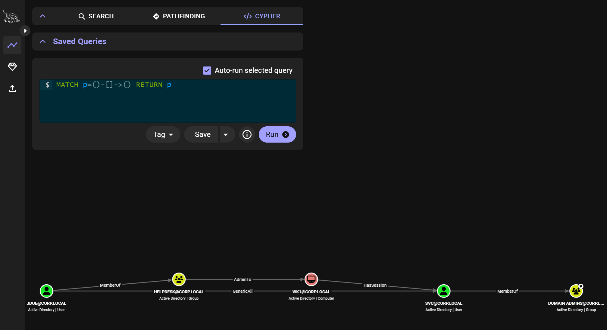

**Click any edge** to open the **Relationship Information** panel — NoiseHound's
`Noise` and `Noise Known` values show up natively:

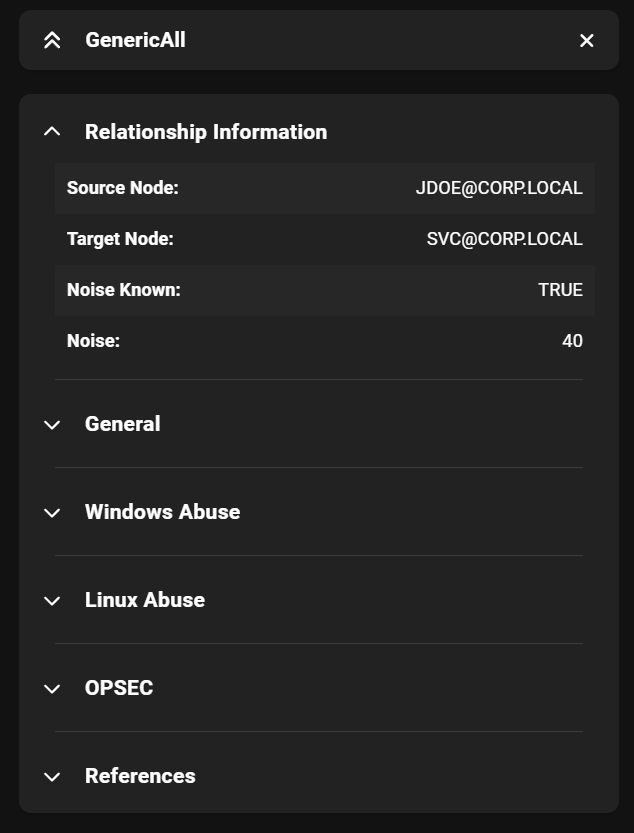

**The loud edges** — techniques that light up a SOC (here `GenericAll` = 40,
`AdminTo` = 25):

```cypher
MATCH p=(a)-[r]->(b) WHERE r.noise >= 25 RETURN p
```

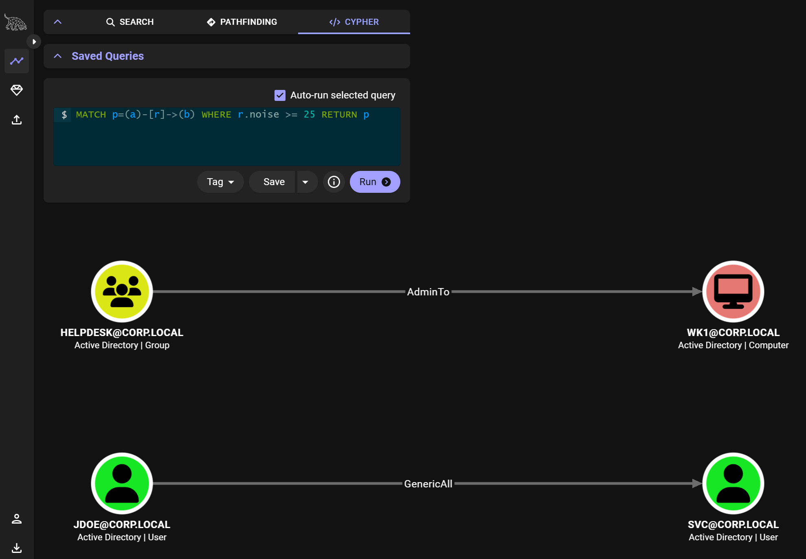
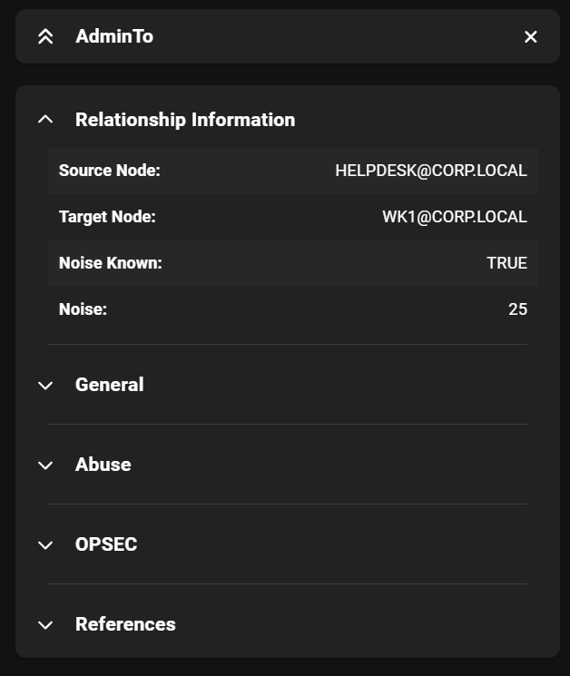

**The quiet blind-spots** — where detection is weakest (`HasSession` = 20,
`MemberOf` = 2). These are the edges an operator wants and a defender should
worry about:

```cypher
MATCH p=(a)-[r]->(b) WHERE r.noise <= 20 RETURN p
```

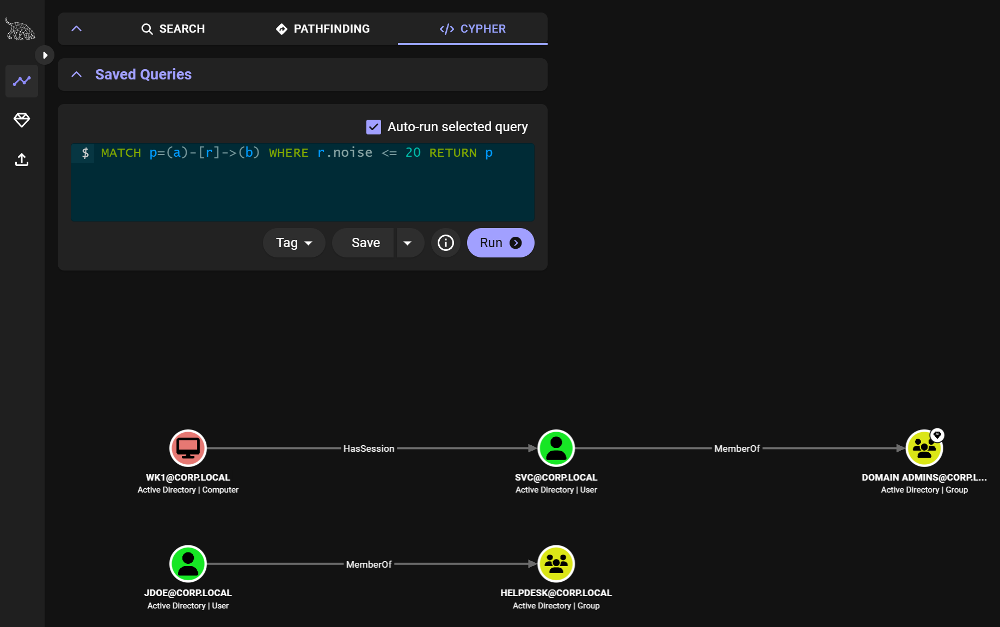
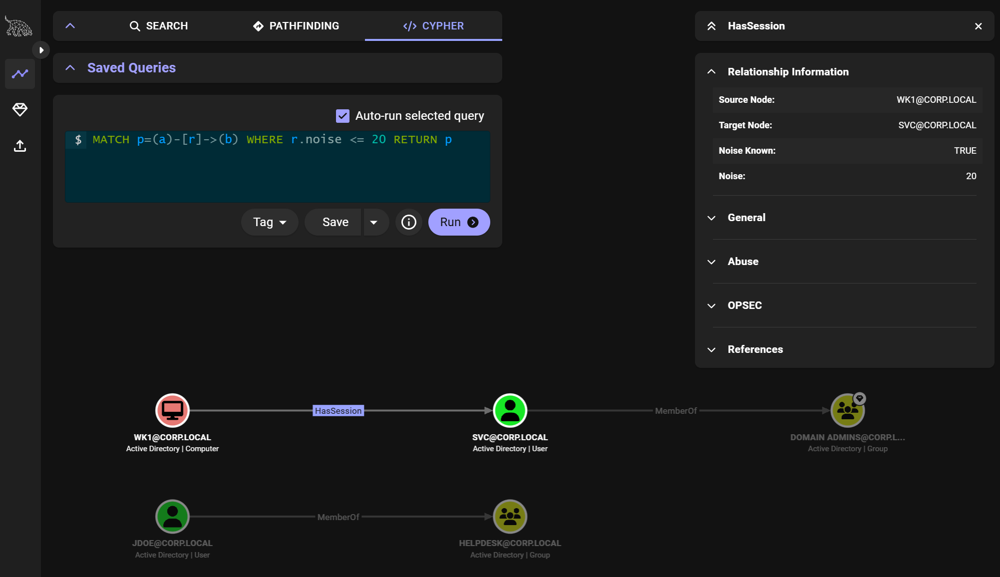
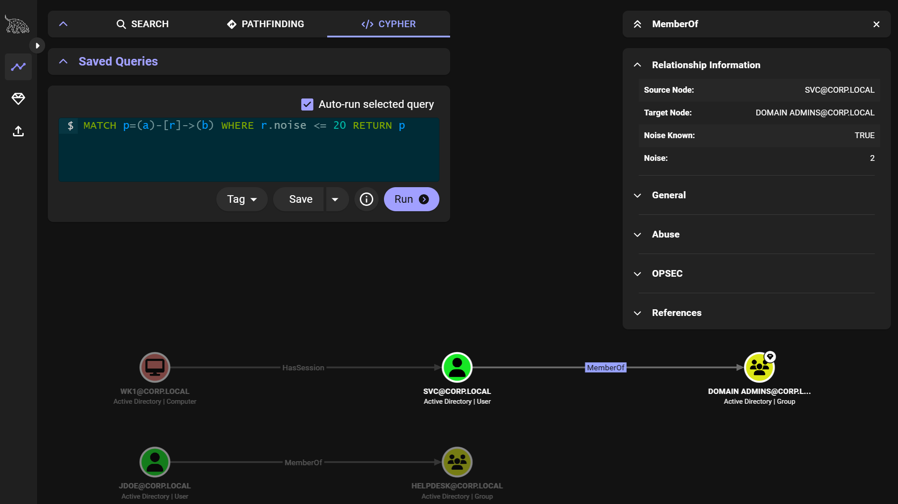

> **Tip:** BHCE's Cypher tab only renders *graph* results. A scalar query like
> `RETURN r.noise` shows "No results" — that is a UI limitation, not missing data.
> Read the numbers from the edge **Relationship Information** panel (above), or
> from `noisehound` / the Neo4j Browser (`:7474`).

### 3.5 Go broader — scores across the whole corpus

The two-route demo keeps the thesis readable, but NoiseHound scores far more than
five techniques. Seed the larger **ACME.LOCAL** showcase (also safe and additive)
and re-run writeback to see scores spanning the corpus from the loudest technique
to the quietest:

```bash
docker exec -i <graph-db> cypher-shell -u neo4j -p <neo4j-password> < docs/seed_showcase_graph.cypher
noisehound-writeback -i bolt://localhost:7687 --neo4j-user neo4j --neo4j-password <neo4j-password>
```

```cypher
MATCH p=(a)-[r]->(b) WHERE a.domain = 'ACME.LOCAL' RETURN p
```

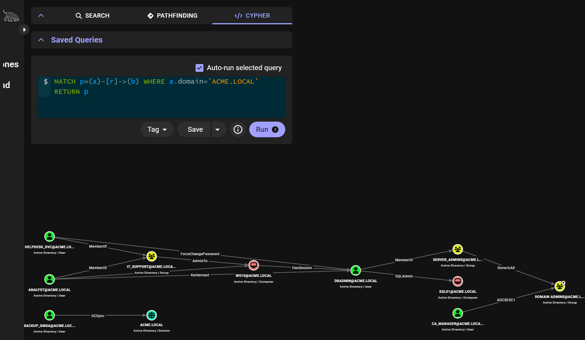

One environment, a dozen techniques, each scored: `DCSync` (85) and `CanRDP` (50)
scream, `GenericAll` (40) and `Kerberoast` (30) are moderate, `HasSession` (20)
and `MemberOf` (2) are near-silent — see [§6](#6-the-corpus-at-a-glance).

Narrow it to just the loud techniques a SOC is most likely to catch:

```cypher
MATCH p=(a)-[r]->(b) WHERE a.domain = 'ACME.LOCAL' AND r.noise >= 45 RETURN p
```

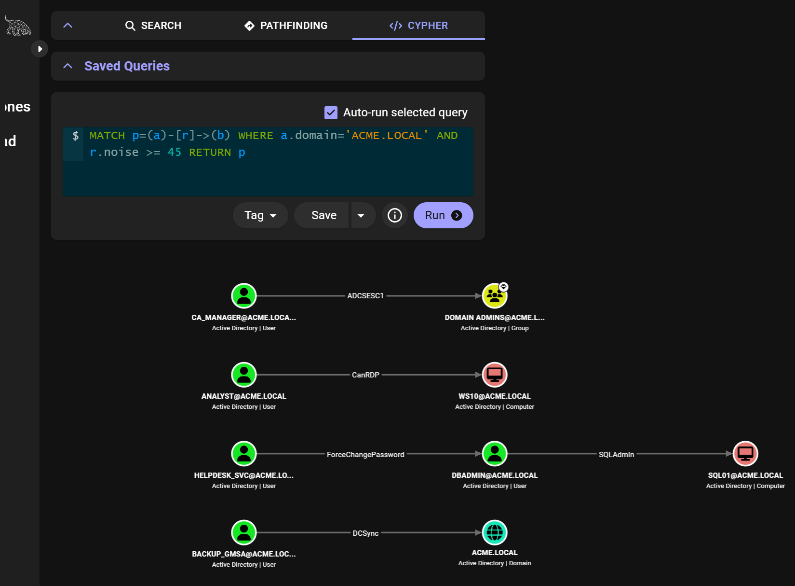

Click the `DCSync` edge and the panel shows the loudest score in the whole corpus
— **Noise 85** — the mirror image of the quiet `MemberOf` (2) from §3.4:

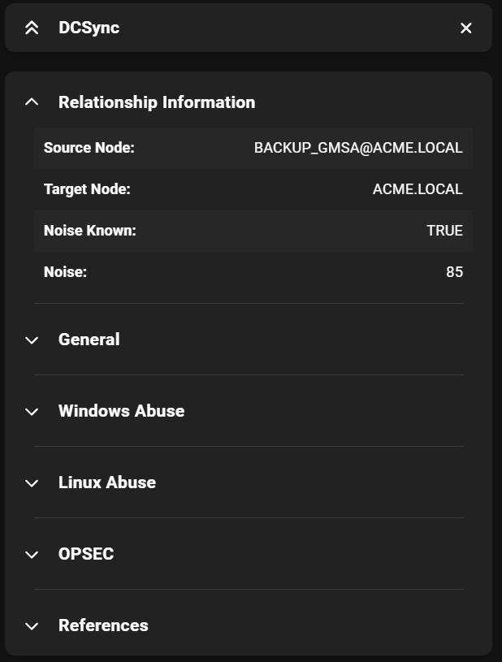

### 3.6 (Optional) Quietest-path query with APOC

BHCE ships APOC but does not load it. If you enable it, you can ask Neo4j for the
minimum-noise route directly. Prefer a **bottleneck** (loudest-step) ranking,
which matches NoiseHound's model — a naive sum-of-noise `apoc.algo.dijkstra` can
disagree with the tool on small graphs. See [`CYPHER.md`](CYPHER.md) for the full
set of copy-paste queries and the APOC-enable snippet.

---

## 4. Part 3 — DeadAir, the native Rust engine

**DeadAir** is NoiseHound's compiled engine core — the same relationship to
NoiseHound that OffsetScan has to OffsetInspect. NoiseHound does ingestion, corpus
annotation and reporting; for large graphs it hands the prepared *scored graph* to
DeadAir, which returns the same ranked paths **10–100× faster**.

### 4.1 Cross-engine parity (same command, both engines)

```bash
python -m noisehound -i bolt://localhost:7687 -s jdoe -o "Domain Admins" -d CORP.LOCAL -k 3 --engine python
python -m noisehound -i bolt://localhost:7687 -s jdoe -o "Domain Admins" -d CORP.LOCAL -k 3 --engine rust
```

Both print the **identical** ranking (quietest 19.9 / 4-hop, then 32.4 / 2-hop).
`--engine auto` (the default) uses DeadAir automatically on large graphs.

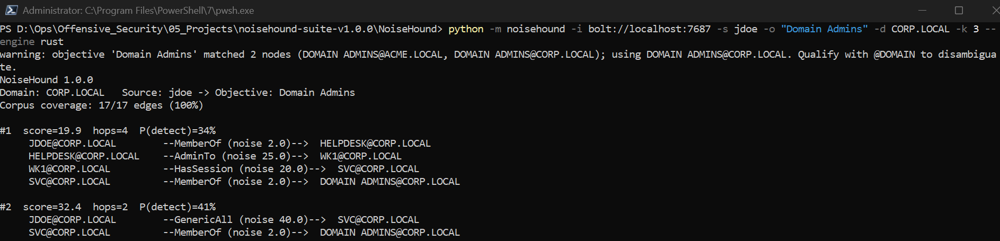

### 4.2 DeadAir standalone

DeadAir also runs directly on a scored-graph JSON — `{nodes, edges}` where each
edge already carries a `noise` score, the exact format NoiseHound hands it:

```json
{
  "nodes": [{"id": "S-1-...", "name": "jdoe@CORP", "type": "User"}],
  "edges": [{"source": "S-1-A", "target": "S-1-B", "edge_type": "GenericAll",
             "noise": 40.0, "corpus_known": true}]
}
```

A ready example ships at [`scored_graph.example.json`](scored_graph.example.json):

```bash
deadair --input docs/scored_graph.example.json --source jdoe --objective "Domain Admins" -k 3 --timing
```

It emits structured JSON (ideal for piping into other tooling), and the scores
match the Python engine to the decimal (`19.9 / 0.337`, `32.4 / 0.406`):

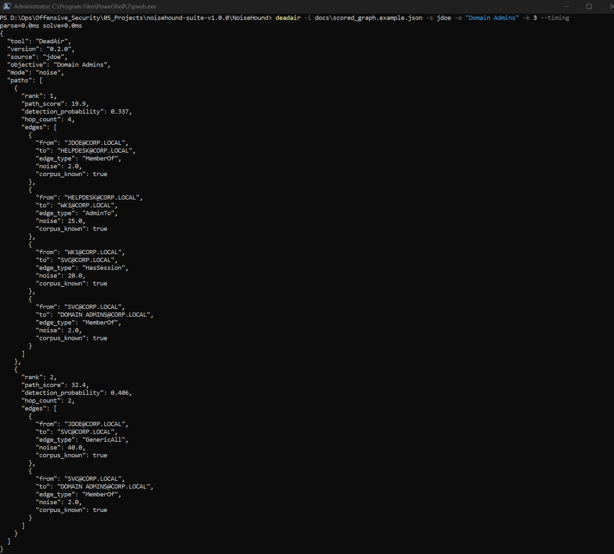

Useful flags:

```bash
deadair -i scored_graph.json -s jdoe -o "Domain Admins" --mode pareto            # trade-off surface, not one ranking
deadair -i scored_graph.json -s jdoe -o "Domain Admins" --avoid-edge GenericAll  # exclude a technique
deadair -i scored_graph.json -s jdoe -o "Domain Admins" --avoid WK1@CORP.LOCAL   # exclude a node
```

Measured solve time (pure pathfinding, 50 candidates):

| Graph | NoiseHound (Python) | DeadAir | Speedup |
|-------|--------------------:|--------:|--------:|
| 40k nodes  | 5.3s  | 51ms  | 103× |
| 100k nodes | 10.0s | 452ms | 22×  |
| 250k nodes | 29.5s | 2.2s  | 14×  |

---

## 5. Part 4 — Blue-team detection-gap mode

The quietest path is exactly where detection is weakest — so the same analysis
flips into a defender's to-do list. Add `--defensive`:

```bash
python -m noisehound -i bolt://localhost:7687 -s jdoe -o "Domain Admins" -d CORP.LOCAL --defensive
```

```
DETECTION-GAP ANALYSIS (blue-team view)

Path #1  quietest now: 19.9  ->  fully instrumented: 48.4  (+28.5 closable)
  GAP HasSession   WK1@CORP.LOCAL   now 20.0 -> 65.0  (gap 45.0)
        + Deploy Sysmon with ProcessAccess (Event 10) rules for LSASS

Path #2  quietest now: 32.4  ->  fully instrumented: 72.4  (+40.0 closable)
  GAP GenericAll   JDOE@CORP.LOCAL  now 40.0 -> 90.0  (gap 50.0)
        + Enable 'DS Access > Directory Service Access' auditing + object SACLs (Event 4662)

Top controls to deploy (ranked by total detection lift across these paths):
  1. [+50.0] Enable 'DS Access > Directory Service Access' auditing + object SACLs (Event 4662)
  2. [+50.0] Enable 'DS Access > Directory Service Changes' auditing (Event 5136/5137)
  3. [+45.0] Deploy Sysmon with ProcessAccess (Event 10) rules for LSASS
```

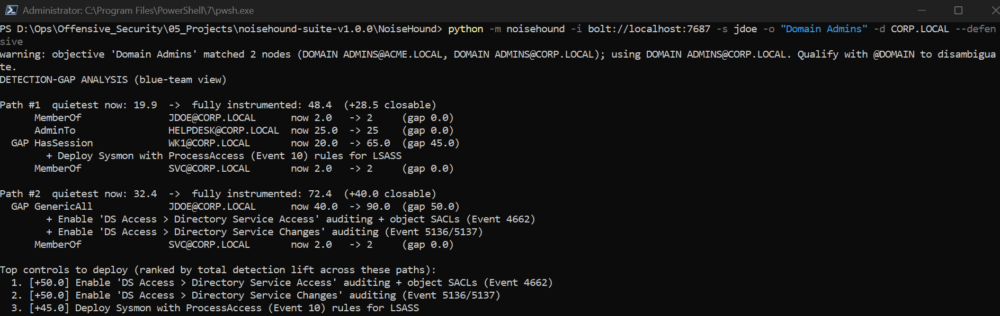

Each `GAP` line is an edge that is quiet *only because its telemetry is off or
absent*, mapped to the specific control (and Windows event / Sysmon rule) that
would catch it — then ranked by how much detection each control would add. It
turns "here is the quiet route" into "here is what to instrument."

---

## 6. The corpus at a glance

NoiseHound scores **57 edge types**; **30 are calibrated against real lab
telemetry** (Windows auditing, Microsoft Defender for Endpoint, Elastic SIEM),
the rest carry conservative expert estimates (flagged `noise_known = false`). A
representative slice of the baseline scores, loud to quiet:

| Edge | Noise | Lab-measured | Edge | Noise | Lab-measured |
|------|------:|:---:|------|------:|:---:|
| DCSync | 85 | ✅ | GenericWrite | 38 | ✅ |
| ADCSESC8 | 60 | | AddMember | 35 | ✅ |
| CoerceToTGT | 55 | | Kerberoast | 30 | ✅ |
| CanRDP | 50 | ✅ | ASREPRoast | 30 | ✅ |
| SQLAdmin | 50 | ✅ | Enroll | 30 | ✅ |
| WriteDacl | 45 | ✅ | AdminTo | 25 | ✅ |
| ForceChangePassword | 45 | ✅ | HasSession | 20 | |
| ADCSESC1 | 45 | ✅ | CrossForestTrust | 18 | |
| GenericAll | 40 | ✅ | GpLink | 8 | |
| Owns | 43 | ✅ | MemberOf | 2 | ✅ |

The full corpus — one JSON per edge, each with its telemetry sources, event IDs,
and reliability — lives in [`edge_mappings/`](../edge_mappings). Environment- and
tier-specific values ship as drop-in profiles in [`profiles/`](../profiles); see
[`CALIBRATION.md`](CALIBRATION.md) to measure your own.

---

## 7. Capability highlights

| Capability | How | Shown in |
|------------|-----|----------|
| Rank paths by detection noise, not hop count | `noisehound -i … -s … -o …` | §2, §3.2 |
| Read BloodHound CE zips, JSON, dirs, or live Neo4j | `-i export.zip` / `-i bolt://…` | §2, §3.2 |
| Write scores back onto the BloodHound graph (additive) | `noisehound-writeback` | §3.3–3.4 |
| See scores natively in the BHCE UI | edge **Relationship Information** panel | §3.4 |
| Parser / coverage sanity check | `noisehound-inspect` | §3.2 |
| Multiple ranking modes | `--mode noise\|probability\|pareto` | §4.2 |
| Constrain the search | `--avoid`, `--avoid-edge` | §4.2 |
| Native engine, 10–100× faster, identical results | DeadAir / `--engine rust` | §4 |
| JSON / HTML / text output | `-f json\|html\|text` | §2 |
| Blue-team detection-gap report | `--defensive` | §5 |
| Environment- and Sigma-aware scoring | `--environment`, `noisehound-sigma` | main README |

---

## 8. Honest scoping

The scores are only as good as the measurements behind them. **30 of the 57
corpus edges are calibrated against real Windows / Defender / Elastic telemetry**
from a lab; the rest carry conservative estimates, clearly flagged as
`noise_known = false` (shown as *defaulted* in the tooling). A detection tool that
lied about its own measurements would be worse than none. See
[`VALIDATION.md`](VALIDATION.md), [`CALIBRATION.md`](CALIBRATION.md), and
[`ROADMAP.md`](ROADMAP.md) for what is measured, how to measure your own
environment, and what is on the roadmap (identity-alert / MDI tier, the full
57-edge measured range, a per-tool noise axis).

---

## 9. Troubleshooting

| Symptom | Cause / fix |
|---------|-------------|
| `unauthorized … authentication failure` from Neo4j | Wrong Bolt password. Use `NEO4J_SECRET` from your BHCE `.env`, **not** the web-login password. |
| Cypher query shows **"No results match your criteria"** | You returned scalars (`RETURN r.noise`). BHCE's Cypher tab only renders graphs — return a path (`RETURN p`) and read values from the edge panel. |
| Uploaded a sample zip, BHCE says "Complete" but **0 nodes** | A minimal, hand-authored export with no `domains.json` won't anchor, and BHCE won't synthesise `AdminTo`/`HasSession` from a tiny fixture. Use a real SharpHound collection, or the safe seed ([`seed_demo_graph.cypher`](seed_demo_graph.cypher)). |
| `writeback` scored fewer edges than exist | Structural or unmapped edge types (e.g. `Contains`, `GetChangesAll`) have no corpus entry and are left unscored by design. Query them with the `noise_known = false` snippet in [`CYPHER.md`](CYPHER.md). |
| `--engine rust` errors | DeadAir binary not found. `cargo install deadair`, or set `$NOISEHOUND_DEADAIR` to its path. |
| APOC `dijkstra` picks a different path than NoiseHound | Sum-of-noise ≠ the model. Rank by the loudest step (bottleneck); the CLI is authoritative. |
| Docker won't start / "Inference manager" crash | Unrelated to NoiseHound — disable Docker Desktop's *Model Runner / AI* feature and restart Docker. Your BHCE volumes are preserved. |
